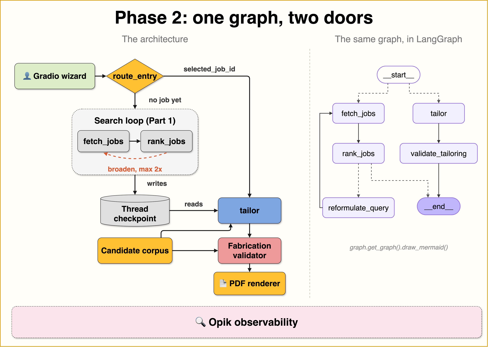

# The Observable Job Agent
## Job Scout: a real AI agent you can see inside

<div align="center">
  <h3>Build an AI job-matching agent, and the observability to trust it</h3>
  <p>Upload your CV (PDF). Get real job openings ranked 0–100 for fit, each with an honest explanation of what matches and where your gaps are.</p>
  <p>Master the most in-demand AI engineering skills: <strong>LLM agents (LangGraph)</strong> and <strong>LLM observability (Opik / LLMOps)</strong></p>
</div>

<p align="center">
  
  
  
  
  
  
</p>

<br/>

<p align="center">
  
</p>

## 📖 About This Project

**Job Scout** is a real, observable AI agent you run on your own machine. Upload
your CV and it extracts a structured profile, searches real job openings, and
ranks each with a **fit score (0–100)** plus an honest explanation of the match
and the gaps. Every LLM and tool call is traced in
[Opik](https://www.comet.com/docs/opik/) from the very first run.

This is the code for *The Observable Job Agent*, a series that builds one
agent while building the ability to see inside it: **Build → Evaluate →
Self-Improve**. This release is **Part 2: Extend, then evaluate**.

> **🎯 The observability difference:** most tutorials add telemetry at the end.
> We don't. The agent gets instrumented *before* it gets good, so cost, latency,
> and quality are measurable from run one. The whole series builds on that
> decision.

> **The human applies. The agent never submits applications.** The bottleneck in
> a job hunt is the research and tailoring per application, not clicking submit.
> That is the part worth automating.

### 🧭 What You'll Build

- **End-to-end agent:** CV (PDF) → typed profile → LLM-driven job search → batched fit ranking → a bounded reformulation loop
- **LLM-driven tool use:** the model chooses the search arguments; your code executes them, and you can watch it choose in the trace
- **Full Opik tracing on every run:** a span tree per node, an auto-drawn agent graph, per-run cost, the CV attached to the trace, and versioned prompts — all from one line of code
- **A Gradio interface** with streamed progress and a run footer (cost, latency, deep link to the trace)
- **Multi-source job search** (JSearch, Adzuna, Remotive, offline cache) that runs with **zero API keys**
- **An honest baseline**: run it at scale, measure everything, document the weaknesses, and resist fixing them too early
- **Phase 2 — application preparation:** select a ranked job and get a tailored cover letter + a reworded one-page CV (LaTeX → PDF), where every bullet carries a `corpus_ref` back to your real experience and a **deterministic fabrication validator** flags anything it can't ground — visibly, never silently
- **Phase 2 — the evaluation stack:** verifiable checks (field accuracy, fabrication rate) vs unverifiable judgments (G-Eval, hallucination judges), datasets built from real traces, ≥2 comparable experiments, agent trajectory metrics, online rules, and a judge-vs-human calibration table

### 📚 The Series

Every part ships as a **GitHub release**, so you can clone the exact code that
matches the blog post you are reading.

| Part | Focus | Blog post | Code release |
|------|-------|-----------|--------------|
| **1** | **Build** | [Build your own Job Agent - Part 1](https://jamwithai.substack.com/p/build-your-own-job-agent-part-1) | [`part1.0`](https://github.com/jamwithai/observable-job-agent/releases/tag/part1.0) |
| **2 (this repo)** | **Extend, then evaluate** | coming soon | coming soon |
| 3 | Self-improve | coming soon | coming soon |

📥 **Clone a specific part's release:**

```bash
git clone --branch part1.0 https://github.com/jamwithai/observable-job-agent
# Replace part1.0 with the release tag of the part you are following
```

Read the deep dives on [Jam with AI](https://jamwithai.substack.com).

---

## 🚀 Quick Start

### 📋 Prerequisites

- **Python 3.12+**
- **[uv](https://docs.astral.sh/uv/getting-started/installation/)** package manager
- One **LLM key** for the agent steps — `OPENAI_API_KEY`, or free via Groq/Ollama. Everything else (tests, job sources, the validator) runs with **no keys at all**.

### ⚡ Get Started

```bash
# 1. Clone
git clone https://github.com/jamwithai/observable-job-agent
cd observable-job-agent

# 2. Install
uv sync --all-groups

# 3. Configure (all keys optional)
cp .env.example .env

# 4. Verify (no network, no credits)
make test

# 5. Launch the app, then upload a CV from data/fixture_cvs/
make app
```

**Job sources run with zero keys** via Remotive + a committed offline cache, and
`make test` needs nothing. The LLM steps — profile extraction, ranking,
tailoring — need one model key: `OPENAI_API_KEY`, or a free path via
`SCOUT_MODEL=groq:…` (free tier) or `ollama:…` (local). Opik tracing has its own
free key — see [`docs/opik_setup.md`](docs/opik_setup.md).

**Default model** is `openai:gpt-4o-mini`. Swap it with one env var: `SCOUT_MODEL`
(e.g. `groq:llama-3.3-70b-versatile` for free, or `ollama:llama3.2` for local).
Free models correctly show $0.00 cost in Opik.

### 📓 Interactive tutorials

- [`notebooks/phase2_evaluation.ipynb`](notebooks/phase2_evaluation.ipynb) — Part 2: the tailoring walkthrough, the stale-checkpoint bug live, datasets and eval suites (cost printed before every spend)
- [`notebooks/phase1_walkthrough.ipynb`](notebooks/phase1_walkthrough.ipynb) — Part 1: the search agent end to end, reading your first trace
- [`notebooks/phase3_ollie.ipynb`](notebooks/phase3_ollie.ipynb) — Part 3: per-source spans, the fan-out measured both ways, and the questions to ask Ollie

### 📊 Access Points

| Service | URL | Purpose |
|---------|-----|---------|
| **Gradio UI** | http://localhost:7860 | Upload a CV, review the profile, find ranked jobs |
| **Jobvis console** | http://localhost:8000 | The voice concierge: holographic orb, live matches, PDF downloads |
| **Opik dashboard** | your Comet project | Span tree, agent graph, per-run cost, prompt library |

---

## 🏗️ Architecture

CV extraction is a preprocessing step (`job_scout.profile`) that produces a typed
`Profile`; the graph takes that profile and focuses on finding jobs:

```
extract_profile(cv) → Profile ─┐
                               ▼
  START → [route_entry] ── no selected job ──→ fetch_jobs → rank_jobs → [enough good matches?]
              │                                    ↑                          │ no
              │                                    └──── reformulate_query ◄──┘   │ yes → END
              └── selected_job_id set ──→ tailor → validate_tailoring → END
                  (reads profile + ranked jobs from the thread's checkpoint — nothing re-runs)
```

- **`fetch_jobs`** is an LLM tool-calling node: the model *chooses* the `search_jobs` arguments (query, country, remote).
- **`rank_jobs`** scores postings in batches of 4 (`SCOUT_RANK_BATCH`), one structured-output call per batch, capped at `SCOUT_MAX_JOBS` (default 10). Already-scored jobs keep their scores across reformulation loops — only new postings hit the model.
- **`reformulate_query`** broadens the search if fewer than 5 jobs score ≥ 60, bounded to at most 2 loops. That conditional edge is what makes this an agent rather than a straight-line workflow.
- **`tailor`** (Phase 2) runs as a *second invocation on the same thread*: it reads the search results from the checkpoint and selects/rewords items from your **CandidateCorpus** (CV + optional official LinkedIn data export — never scraped). **`validate_tailoring`** then checks every claim deterministically — its thresholds are env-tunable (`SCOUT_FAB_*`), and each report records the values it ran with in the Opik trace, so tuning them against your own CV is a measurable exercise. The PDF renders via `tectonic` (`brew install tectonic`); without it you get the `.tex` + an Overleaf pointer.

The search fans out over **JSearch** (primary, city-level), **Adzuna**
(international), **Remotive** (keyless remote), and a **committed offline cache**.
Full walkthrough: [`docs/architecture.md`](docs/architecture.md). Adding a source:
[`docs/extending_sources.md`](docs/extending_sources.md).

---

## 🎙️ Jobvis — the voice concierge (optional)

Ask out loud — *"what jobs are available?"* — and a dry English butler reads you
your top three matches with fit scores and gaps, starts a search or tailors an
application on request, and the finished PDF pops up on screen by itself.
Built on **ElevenLabs Agents** with the app's Python functions registered as
client tools: the agent can only speak what the LangGraph checkpoint returns —
the Phase 2 grounding contract, applied to voice (watch the tool calls appear in
the transcript panel).

```bash
# put ELEVENLABS_API_KEY in .env — free tier: 15 conversation min/month.
# The key needs the Agents Platform (Conversational AI) scopes enabled.
make jobvis-agent        # create the agent, copy the printed id into .env
make web-build           # build the console (Next.js static export)
make app                 # wizard on :7860 AND the console on :8000, one process
```

The conversation runs in your **browser** over WebRTC, so you get real barge-in
and the browser's own echo cancellation — and there is no audio library to
build. Your key never leaves the Python process: the page asks for a
short-lived session token and nothing more.

Job Scout **remembers your resume between runs** — and **where you want to
work**: the extracted profile and your chosen search locations (the step-2
"Where should we search?" chooser; the model suggests, you decide) are saved
locally (`data/candidate/`, gitignored), so a restart opens straight on step 2
and Jobvis knows you immediately — "Start over" is what forgets it.
Jobs are deliberately *not* persisted (postings go stale): each session
fetches fresh, one spoken "find me jobs" away.

Two surfaces, one session: the wizard on :7860 for the manual click-flow, and
the **voice console** on :8000 — a full-dark page whose holographic orb breathes
with Jobvis's actual voice, with live top-matches, the application panel and its
PDF downloads. Everything after the CV upload can happen by voice. Optional
**hand control** (pinch to spin the orb, MediaPipe in the browser) is off behind
a flag; see [`docs/jobvis.md`](docs/jobvis.md).

Worth knowing: one voice-triggered run at a time (don't click the wizard's own
buttons mid-run); you can hang up during a long run — the result still lands on
both surfaces. Full chapter, demo script and troubleshooting:
[`docs/jobvis.md`](docs/jobvis.md).

---

## 🔧 Reference

### 🛠️ Technology Stack

| Component | Purpose |
|-----------|---------|
| **LangGraph** | The agent graph + conditional reformulation loop |
| **LangChain** | `init_chat_model`, LLM-driven tool calling |
| **Opik / Comet** | Observability: traces, per-run cost, versioned prompts |
| **Gradio** | Four-step wizard UI with streamed progress |
| **Pydantic + pydantic-settings** | Typed schemas and configuration |
| **httpx + pypdf** | Job-source HTTP and CV reading |
| **Job sources** | JSearch, Adzuna, Remotive, committed offline cache |

**Development tools:** uv, Ruff, Pytest, pre-commit.

### 🏗️ Project Structure

```
observable-job-agent/
├── src/job_scout/
│   ├── app.py          # Gradio four-step wizard UI (Resume → Profile → Jobs → Tailor)
│   ├── candidate_store.py  # the persisted candidate: profile + CV text + preferences
│   ├── runner.py       # run orchestration shared by UI + batch (tracing, cost, latency)
│   ├── profile.py      # CV text → Profile (pre-graph extraction)
│   ├── corpus.py       # CandidateCorpus: CV + optional LinkedIn export (the grounding source)
│   ├── validation.py   # deterministic fabrication validator (difflib, zero LLM)
│   ├── renderer.py     # Jinja2 → LaTeX → PDF via tectonic (degrades to .tex)
│   ├── config.py       # Settings (pydantic-settings, SecretStr keys)
│   ├── llm.py          # chat-model factory + per-run call budget
│   ├── tracing.py      # all Opik wiring in one module
│   ├── evals/          # metrics.py: ProfileFieldAccuracy, FabricationRate, FitExplanationQuality
│   ├── voice/          # Jobvis: bridge.py, tools.py, persona.py, announce.py (no SDK, no audio)
│   ├── api.py          # FastAPI: session tokens, tool dispatch, state, SSE, serves the console
│   ├── graph/          # graph.py (entry router + search + tailor), state.py, schemas.py, nodes/, prompts/
│   ├── templates/      # cv.tex.j2 — the single ATS-friendly CV template
│   └── tools/          # jobs_api.py (JSearch/Adzuna/Remotive/cache), cv_reader.py, research.py (Tavily)
├── web/                # the Jobvis voice console (Next.js + Three.js, WebRTC)
├── notebooks/          # phase1_walkthrough.ipynb, phase2_evaluation.ipynb, phase3_ollie.ipynb
├── scripts/            # run_batch.py, run_tailor_batch.py, build_*_dataset.py, run_evals.py,
│                       # setup_annotation_queue.py, snapshot_jobs.py, generate_fixture_*.py
├── data/               # cached_jobs.json, fixture_cvs/, fixture_linkedin/, labels/ (hand labels)
├── docs/               # architecture.md, opik_setup.md, extending_sources.md, jobvis.md,
│                       # ollie.md, optimizing_latency.md, baseline.json, tailor_batch.json,
│                       # phase*_findings.md, phase2_eval_report.md
└── tests/              # 217 tests (LLM mocked, network mocked, Opik off)
```

### 🔧 Essential Commands

```bash
make setup         # uv sync + pre-commit hooks
make app           # launch the Gradio app
make web-build     # build the console (Next.js static export into web/out)
make jobvis-api    # API only, no wizard — for frontend work with make web-dev
make batch         # baseline batch (prints projected cost; add --yes to run)
make tailor-batch  # Phase 2 tailoring batch (search + tailor per case)
make eval-datasets # push ranking + tailoring datasets to Opik from traces
make evals         # eval harness usage (extraction/ranking/tailoring/trajectory/calibration)
make queue         # create the Opik annotation queue + feedback definitions
make snapshot      # rebuild data/cached_jobs.json from live sources
make fixtures      # regenerate the synthetic fixture CVs + LinkedIn export ZIPs
make jobvis-agent  # create/update the Jobvis ElevenLabs agent (prints the agent id)
make gates         # deterministic eval regression gate (zero LLM calls)
make test          # run the test suite
make lint          # ruff check
make format        # ruff format + fix
```

### 🎓 Target Audience

| Who | Why |
|-----|-----|
| **AI/ML Engineers** | Learn production agent architecture and LLMOps beyond tutorials |
| **Software Engineers** | Build an end-to-end LLM agent with observability baked in |
| **Data Scientists** | See how to measure an AI system honestly before optimizing it |

---

## 🛠️ Troubleshooting

- **No jobs / all `source: cache`** — you have no live-source keys, or the network is blocked. Expected; the cache is the offline fallback. Add Adzuna/JSearch keys and re-run `make snapshot`.
- **Cost shows $0.00** — you're on a free model (Groq/Ollama). Opik prices only OpenAI/Anthropic/Google models.
- **No traces in Opik** — check `OPIK_ENABLED=true` and that `OPIK_API_KEY` / `OPIK_WORKSPACE` are set. See [`docs/opik_setup.md`](docs/opik_setup.md).

---

## 💰 Cost

Reproducing everything in Part 1 costs **under $0.50** with API models, or is
**fully free** with local models (Ollama) or free tiers. The app runs with zero
keys via Remotive + the offline cache.

---

<div align="center">
  <h3>🎉 Ready to build an agent you can actually trust?</h3>
  <p><strong>Clone it, add one LLM key, <code>make app</code>, and drop in a fixture CV.</strong></p>
  <p><em>Built with love by <a href="https://www.linkedin.com/in/shirin-khosravi-jam/">Shirin Khosravi Jam</a></em></p>
</div>

---

## ⭐ Star History

[](https://star-history.com/#jamwithai/observable-job-agent&Date)

---

## 📄 License

MIT License — see [LICENSE](LICENSE) for details.
