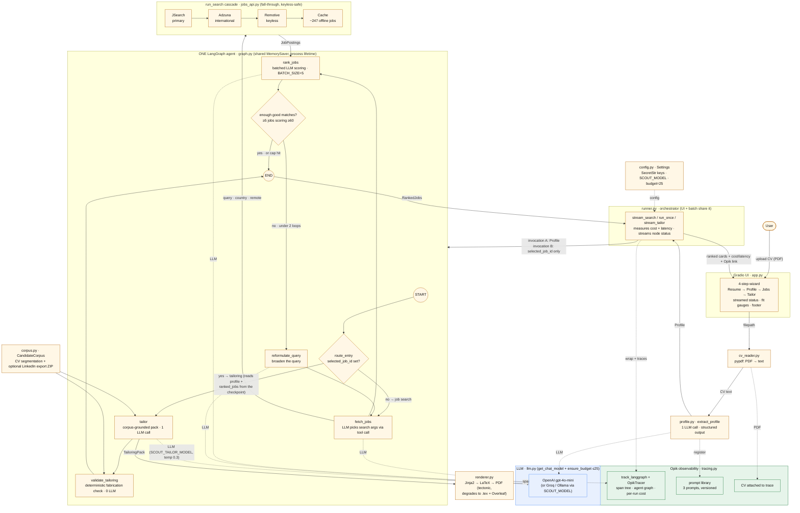

# Job Scout — Architecture

Grounded in the current code (`src/job_scout/…`). Renders anywhere Mermaid is
supported (GitHub, most blog engines). Legend: **solid arrows** = data flow,
**dotted arrows** = cross-cutting concerns (LLM calls, Opik tracing, config).

The diagram above is also available as editable Mermaid source:

## Reading it

1. **Upload → text → profile.** The Gradio wizard hands the PDF to `cv_reader`
   (pypdf), then `extract_profile` turns the text into a typed `Profile` with one
   structured-output LLM call — *before* the graph, so it's extracted once.
2. **The agent graph.** `runner.py` feeds the profile into the LangGraph:
   `fetch_jobs` (the LLM chooses the search arguments) → `rank_jobs` (batched fit
   scoring) → a conditional edge that either loops through `reformulate_query`
   (max 2) to broaden the search, or ends.
3. **Job sources.** `fetch_jobs` calls the `run_search` cascade — JSearch →
   Adzuna → Remotive → offline cache — each tried only if the previous returned
   too few, so it runs with **zero API keys**.
4. **The tailoring pipeline (Phase 2).** The SAME compiled graph gains a
   conditional entry: when the caller passes only `selected_job_id`, the
   `route_entry` router sends the invocation to `tailor`, which reads `profile`,
   `ranked_jobs`, and `cv_text` from the thread's **checkpoint** — nothing
   re-runs. `tailor` selects and rewords items from the `CandidateCorpus` (CV +
   optional LinkedIn data export), then `validate_tailoring` deterministically
   checks every bullet, skill, and factual cover-letter sentence against the
   corpus (`fabrication_flags` — logged, never retried). The pack renders to a
   one-page PDF via Jinja2 → LaTeX → tectonic, degrading to a `.tex` + Overleaf
   pointer when tectonic is absent.
5. **One graph, one checkpointer.** `get_compiled_graph()` holds a single
   compiled graph + `MemorySaver` for the process lifetime, so the tailor
   invocation lands on the search invocation's thread. That makes the "second
   invocation, same thread, no recomputation" trace possible — and makes
   explicitly nulling `selected_job_id` on every search invocation mandatory
   (the runner does; the phase 2 notebook demonstrates the stale-state bug).
6. **Cross-cutting (dotted).** Every node's LLM call goes through `llm.py`
   (provider-agnostic + a per-run call budget; the budget is per-THREAD now that
   search and tailor share a checkpoint). **Opik** traces every run: span tree,
   the auto-drawn agent graph (per-run tracer via `trace_graph`), per-run cost,
   the versioned prompt library (4 prompts), and the CV attached to the trace.
   `config.py` supplies keys and settings.
