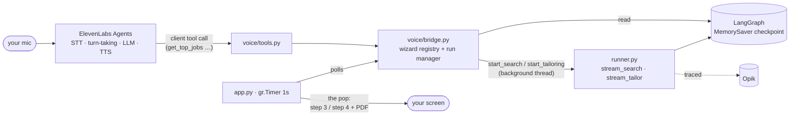

# Jobvis — a voice concierge over an observable agent

*The Phase 2 grounding lesson, applied to a new modality: a voice agent that can
only speak what the graph's checkpoint returns.*

Ask **"what jobs are available?"** and Jobvis — a calm, dry English butler —
reads your top three matches with fit scores and honest gaps. Ask it to
**"tailor an application for the second one"** and a minute later the finished
pack pops up on screen, cover letter and PDF included, while Jobvis offers you
the highlights. The voice is the remote control; the screen stays the canvas.

---

## Architecture

Jobvis is **ElevenLabs Agents** (their STT, turn-taking, LLM, and TTS) with the
app's own Python functions registered as **client tools** — functions that
execute *in the Job Scout process*, right next to the LangGraph checkpoint:



Module tour (`src/job_scout/voice/`):

| File | Job | Imports the SDK? |
|------|-----|------------------|
| `bridge.py` | Thread-safe registry of the active wizard session (thread_id, profile, CV text) + run manager for voice-triggered background runs | no |
| `tools.py` | The seven client tools; every payload built from bridge/checkpoint data, trimmed to be *spoken* | no |
| `persona.py` | System prompt, greeting, tool schemas, preferred voices — agent config as code | no |
| `session.py` | Wraps the SDK `Conversation` in a daemon thread; status + transcript for the UI | lazily |

That import discipline is deliberate: the base app runs (and the test suite
passes) without the `voice` extra installed. Only starting a session touches
ElevenLabs.

## The grounding story

Phase 2's thesis was that **generation must be grounded**: the fabrication
validator checks every CV claim against the corpus. Jobvis extends the same
contract to conversation. The persona's house rule is *"every fact must come
from a tool result"*, and the tools can only return what the checkpoint holds —
`RankedJob.fit_score`, `.matched_skills`, `.gaps`, the tailored pack, the
fabrication verdict. Open the **transcript panel** during a session: every
`⚙ get_top_jobs(...)` line is a grounding event you can watch happen. If Jobvis
says "87 out of 100", there is a tool call above it that returned 87.

### Persistence: remember the candidate, refetch the jobs

Session state splits by lifetime. The **candidate** (extracted CV text + typed
profile) changes rarely, so it persists across restarts in `data/candidate/`
(gitignored — personal data): the app reopens on step 2, the bridge is
pre-seeded, and Jobvis knows you from the first greeting with zero LLM cost.
**Jobs** go stale daily, so search results are deliberately *never* persisted —
each session fetches fresh, either with the Find jobs button or by telling
Jobvis "find me jobs" (on-demand rather than auto-on-startup, to protect your
JSearch quota and LLM budget during development). "Start over" is the explicit
forget-me: it clears the stored candidate as well as the wizard.

Two design choices keep the long-running parts honest:

- **Fire-and-forget runs.** `start_search`/`start_tailoring` return in
  milliseconds while the real run streams on a background thread — ElevenLabs
  tool timeouts never bite, and Jobvis stays conversational during the wait
  ("ask me how it's going"). `get_run_status` relays the runner's live status
  lines ("ranking 12 jobs…").
- **The pop.** The app's 1-second `gr.Timer` polls the bridge; a finished run is
  handed over exactly once and rendered by the *same* functions the buttons use
  (`_results_html`, `_pack_html`, `render_pdf`). Search pops step 3; tailoring
  pops step 4 with the PDF — even if you hung up the voice session mid-run.

## Observability

Voice-*triggered* runs go through `runner.py` like every other run, so they are
fully traced in Opik under the tags `["phase-2", "voice"]` — same span tree,
same cost accounting. What is **not** traced is Jobvis's own conversational
brain: that LLM runs on ElevenLabs' side. The boundary is visible and honest —
tool calls are logged locally and shown in the transcript; the agent's reasoning
lives in the ElevenLabs dashboard's conversation history. (Pointing the agent at
your own LLM via their custom-LLM passthrough would close that gap; deliberately
out of scope here.)

## Setup

1. **Sign up** at elevenlabs.io — the free tier includes ~15 conversation
   minutes/month (enough to build and film a short demo; the ~$5 Starter tier
   buys ~75).
2. **Install the system audio dep** (pyaudio builds against it):
   ```bash
   brew install portaudio
   ```
3. **Configure**: put `ELEVENLABS_API_KEY=...` in `.env`. The key must have the
   **Agents Platform (Conversational AI) read + write scopes** — an unrestricted
   key works; a restricted one returns 401 on the agent endpoints.
4. **Create the agent** (idempotent — safe to re-run after editing the persona):
   ```bash
   make jobvis-agent
   # → prints ELEVENLABS_AGENT_ID=agent_... ; paste it into .env
   ```
5. **Sanity-check the SDK** (optional but recommended once):
   ```bash
   uv run --extra voice python scripts/spike_jobvis_sdk.py          # import/signature checks
   uv run --extra voice python scripts/spike_jobvis_sdk.py --live   # one real round-trip with a dummy tool
   ```
6. `make app-voice` — a **Talk to Jobvis** strip now sits above the wizard.
   (Plain `make app` re-syncs the venv *without* the extra — uv strips it — and
   the strip degrades to a hint.)

First start: macOS asks for **microphone access for your terminal app** (or
IDE), not the browser — the audio pipeline runs in the Python process. Grant it
in System Settings → Privacy & Security → Microphone if you dismissed the
prompt.

## The demo script (60–90 seconds)

The attention-catcher. Film the screen with audio; the transcript panel open on
the side sells the grounding.

| Beat | You say | What happens |
|------|---------|--------------|
| 1 | *(tap Talk to Jobvis)* | "Jobvis, at your service. Shall I run through your top matches?" |
| 2 | "Not yet — what can you actually see?" | Polite honesty: no CV uploaded, asks you to drop one. `⚙ get_session_status()` in the transcript. |
| 3 | *(drop a fixture CV, then)* "Find me jobs." | "I've started — takes about a minute." Wizard advances to step 3 **by itself**; ranked cards appear. |
| 4 | "So what are my top three?" | Three titles, companies, scores out of 100, and gaps — every number visible in the `⚙ get_top_jobs(3)` result. |
| 5 | "Tailor an application for the second one." | "On it." A minute later **step 4 pops with the PDF**. |
| 6 | "Give me the highlights." | Target job, letter length, CV headline, and the fabrication verdict: "every claim checked against your CV — no flags." |
| 7 | "Thank you, Jobvis." | Something dry. Cut. |

Rehearse by **text** in the ElevenLabs dashboard (agent → Test) — it exercises
the same prompt without spending conversation minutes. Keep live sessions short;
hang up during the waits (the pop happens anyway).

## Limits & troubleshooting

| Symptom | Cause / fix |
|---------|-------------|
| Strip shows "Jobvis is off — …" | The hint names the missing piece: API key, agent id, or the voice extra. A common cause: you launched with `make app`, which strips the extra — use `make app-voice`. |
| `make jobvis-agent` fails with 401 | The API key lacks Agents-platform scopes. Dashboard → Developers → API Keys → your key → enable the Agents Platform (Conversational AI) read + write permissions, or create an unrestricted key. |
| The voice extra fails building pyaudio | `brew install portaudio` first. |
| Says "listening" but goes silent after the first question; server log shows `1008 (policy violation) … ClientToolResultClientToOrchestratorEvent` | A tool result reached ElevenLabs as a raw dict — the protocol requires a JSON *string* (their docs claim otherwise). `session.py`'s wrapper `json.dumps`-encodes every result; if you add a new tool path, keep that. |
| Session starts, hears nothing | Mic permission went to the terminal app — System Settings → Privacy & Security → Microphone. |
| Jobvis answers itself in a loop; "You:" lines repeat Jobvis's own words | Acoustic echo: on open speakers the mic hears the agent (pyaudio has no echo cancellation). The built-in **echo gate** silences the mic while Jobvis speaks (default on), and the persona is told to ignore its own echo. Headphones remove the problem entirely — set `JOBVIS_ECHO_GATE=false` with headphones to get barge-in interruptions back. |
| Session drops mid-conversation | Likely free-tier minutes exhausted — check the ElevenLabs dashboard usage page. |
| Jobvis says there are no results but the page shows some | The app was restarted: the in-process `MemorySaver` is empty, and Jobvis answers from the checkpoint — truthfully. Re-run the search. |
| "I'm still busy with the current search…" | One voice-triggered run at a time, by design. Also avoid clicking the wizard's own buttons while a voice run is in flight. |
| Two browser tabs | One bridge — the last loaded tab wins. Single-user app. |
| App restarts on step 2 with a profile you don't want | That's the persisted candidate — click "Start over" (or delete `data/candidate/`) to forget it. |

## What this chapter deliberately leaves out

A wake word ("Hey Jobvis" — openWakeWord ships a pretrained *hey jarvis* model),
custom-LLM passthrough for full-trace observability, and a fully local stack
(Pipecat + local Whisper + Kokoro TTS would slot in where ElevenLabs sits, at
the cost of voice quality and turn-taking). Each is a natural Phase 3+ episode;
the seams for all three are already in `session.py`.
